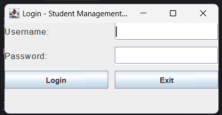

# Java-Student-Manager
This is a desktop-based Student Management System built using Java Swing. The application allows users to securely log in, register new accounts, and manage student records through a simple GUI. It supports adding, viewing, updating, and deleting student information.
# 🧑‍🎓 Student Management System 

A simple desktop-based application that lets users manage student records using Java Swing GUI.

## 🚀 Features

- ✅ Add / View / Update / Delete students
- 🔐 Login system with secure password check

---
### 🔐 Login Screen

        ---

  ## 📁 Project Structure

Student-Management-System/
├── src/
│ ├── LoginScreen.java
│ ├── smsimage.png
│ ├── Student.class
│ └── StudentManagementGUI.java
